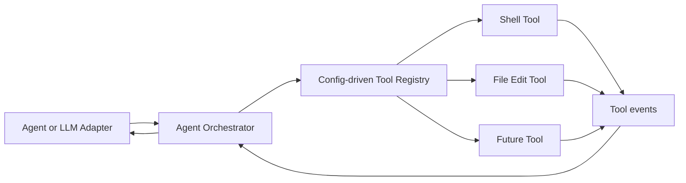

# Agent Orchestrator Protocol

The Agent Orchestrator is a standalone JSON-RPC 2.0 process that connects to independent Tool processes over Unix sockets. It does not import Tool business packages and does not execute Tool operations itself.

The default socket is `/run/agent/orchestrator.sock`. Each JSON-RPC message occupies one line, and protocol version is `1`.

## Architecture



## Methods

| Method | Purpose |
| --- | --- |
| `orchestrator.tools` | List registered Tools and optionally discover capabilities |
| `orchestrator.reload` | Reload the Tool registry JSON file |
| `orchestrator.route` | Resolve a method to exactly one Tool by prefix |
| `orchestrator.call` | Call one Tool explicitly or through automatic routing |
| `orchestrator.batch` | Run serial or parallel Tool calls |
| `orchestrator.health` | Probe every registered Tool |
| `system.initialize` | Negotiate protocol and Orchestrator capabilities |
| `system.capabilities` | Return Orchestrator capabilities |
| `system.health` | Return Orchestrator process health |
| `system.shutdown` | Gracefully close Tool connections and stop |

## Tool registry

```json
{
  "protocol_version": "1",
  "tools": [
    {
      "name": "read-file",
      "socket": "/run/agent/read-file-tool.sock",
      "method_prefixes": ["read."],
      "required": false,
      "description": "Bounded file reading"
    }
  ]
}
```

Tool names must be unique lowercase identifiers. Method prefixes must not start with `system.` because system methods exist on every Tool. Automatic routing succeeds only when exactly one registered Tool matches the method.

To add a new Tool:

1. Start its independent process and Unix socket.
2. Add one registry entry with a unique name and method prefix.
3. Call `orchestrator.reload`.
4. Call `orchestrator.tools` with `{"discover":true}` to verify initialization.

No Orchestrator source-code change or rebuild is needed.

## Single call

Explicit routing:

```json
{
  "tool": "read-file",
  "method": "read.lines",
  "params": {
    "path": "README.md",
    "start_line": 1,
    "end_line": 20
  },
  "timeout_ms": 5000
}
```

Automatic routing omits `tool`:

```json
{
  "method": "search_text.search",
  "params": {
    "path": ".",
    "query": "TODO"
  }
}
```

The response preserves the raw downstream result:

```json
{
  "tool": "search-text",
  "method": "search_text.search",
  "result": {"matches": []},
  "duration_ms": 4
}
```

Downstream JSON-RPC error codes are forwarded unchanged.

## Batch calls

```json
{
  "parallel": true,
  "fail_fast": false,
  "calls": [
    {"tool":"read-file","method":"system.health"},
    {"tool":"search-text","method":"system.health"}
  ]
}
```

Results retain input indexes. Serial batches preserve order. Parallel batches run within the Orchestrator concurrency limit.

## Tool events

Notifications emitted by downstream Tools are wrapped and forwarded to every connected Orchestrator client:

```json
{
  "jsonrpc": "2.0",
  "method": "orchestrator.tool_event",
  "params": {
    "tool": "shell",
    "method": "exec.output",
    "params": {"request_id":"req-1","sequence":1},
    "timestamp": "2026-08-04T12:00:00Z"
  }
}
```

This preserves Shell Tool streaming output and future Tool notification types without hard-coded event schemas.

## Error codes

| Code | Meaning |
| --- | --- |
| `-32540` | Invalid Orchestrator request |
| `-32541` | Tool name not registered |
| `-32542` | Method has no route or an ambiguous route |
| `-32543` | Tool unavailable or timed out |
| `-32544` | Orchestrator concurrency capacity reached |
